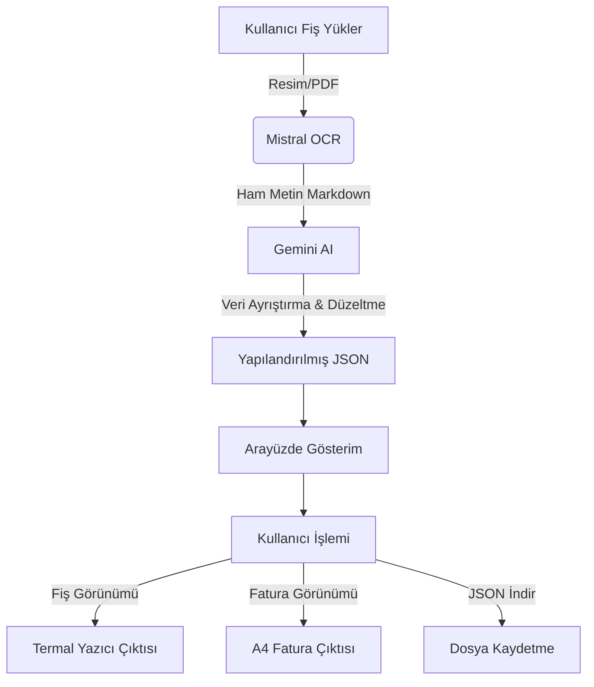

# 🧾 AI Invoice Scanner (Fiş Tarama)


**AI Invoice Scanner**, fiş ve faturalarınızı yapay zeka destekli OCR teknolojisi ile tarayan, dijitalleştiren ve düzenleyen modern bir web uygulamasıdır. Mistral AI ve Google Gemini modellerini kullanarak kağıt üzerindeki verileri saniyeler içinde anlamlı verilere dönüştürür.

## 🚀 Özellikler

*   **Yapay Zeka Destekli OCR:** Mistral OCR ile yüksek doğrulukta metin okuma.
*   **Akıllı Ayrıştırma:** Google Gemini AI ile fiş verilerini (Tarih, Mağaza Adı, Ürünler, KDV, Toplam Tutar) otomatik sınıflandırma.
*   **Otomatik Hesaplama:** Eksik veya hatalı okunan tutarları matematiksel olarak doğrulama ve düzeltme.
*   **Görselleştirme:** Taranan fişi, termal fiş veya A4 fatura formatında görüntüleme.
*   **Yazdırma Desteği:**
    *   **Fiş Modu:** 80mm termal yazıcılar için optimize edilmiş çıktı.
    *   **Fatura Modu:** A4 kağıt boyutunda, kenar boşlukları ayarlanmış profesyonel fatura çıktısı.
*   **Dışa Aktarma:** Verileri JSON formatında indirme imkanı.
*   **Maliyet Analizi:** İşlem başına tahmini token ve maliyet hesaplaması.

## 🛠️ Kullanılan Teknolojiler

*   **Frontend:** React, TypeScript, Vite
*   **Stil:** Tailwind CSS, Lucide React (İkonlar)
*   **Yapay Zeka:**
    *   **OCR:** Mistral OCR (`mistral-ocr-latest`)
    *   **Veri İşleme:** Google Gemini 2.5 Flash Lite (`gemini-2.5-flash-lite`)
*   **Yazdırma:** `react-to-print`

## 📋 Gereklilikler

Bu projeyi çalıştırmak için bilgisayarınızda aşağıdakilerin kurulu olması gerekir:

*   [Node.js](https://nodejs.org/) (Sürüm 18 veya üzeri önerilir)
*   [Git](https://git-scm.com/)

## ⚙️ Kurulum (Adım Adım)

En temel seviyede kurulum adımları aşağıdadır:

1.  **Projeyi İndirin (Klonlayın):**
    Terminali (Komut İstemi veya Terminal) açın ve şu komutu yapıştırın:
    ```bash
    git clone https://github.com/mobiza/ai-invoice-scanner.git
    cd ai-invoice-scanner
    ```

2.  **Gerekli Paketleri Yükleyin:**
    Proje klasörünün içindeyken şu komutu çalıştırın:
    ```bash
    npm install
    ```

3.  **Ayarları Yapılandırın (.env):**
    *   Proje ana dizinindeki `.env.example` dosyasının adını `.env` olarak değiştirin (veya yeni bir `.env` dosyası oluşturun).
    *   Bu dosyanın içine API anahtarlarınızı yapıştırın (Aşağıdaki "Yapılandırma" başlığına bakın).

4.  **Uygulamayı Başlatın:**
    ```bash
    npm run dev
    ```
    Komut çalıştıktan sonra tarayıcınızda `http://localhost:25300` (veya terminalde belirtilen adres) adresine gidin.

## 🔑 Yapılandırma (.env)

Projenin çalışması için API anahtarlarına ihtiyacınız vardır. `.env` dosyanız şu şekilde olmalıdır:

```env
# Mistral AI API Anahtarı (OCR için)
VITE_MISTRAL_API_KEY=Sizin_Mistral_API_Anahtariniz

# Google Gemini API Anahtarı (Ayrıştırma için)
VITE_GEMINI_API_KEY=Sizin_Gemini_API_Anahtariniz

# Kullanılacak Modeller (İsteğe Bağlı Değiştirilebilir)
VITE_GEMINI_MODEL=gemini-2.5-flash-lite
VITE_MISTRAL_MODEL=mistral-ocr-latest
```

## 🔄 Çalışma Akışı



1.  **Yükleme:** Kullanıcı bir fiş fotoğrafı veya PDF yükler.
2.  **OCR (Mistral):** Görüntü metne dönüştürülür.
3.  **Analiz (Gemini):** Metin içindeki mağaza adı, tarih, ürünler ve fiyatlar ayrıştırılır. Hatalı okumalar (örn. 0 yerine O) düzeltilir.
4.  **Sonuç:** Kullanıcıya temizlenmiş, hesaplamaları doğrulanmış bir fiş veya fatura sunulur.

## 🤝 Katkıda Bulunma

Projeye katkıda bulunmak isterseniz çok seviniriz!

1.  Bu depoyu (repository) forklayın.
2.  Yeni bir özellik dalı (branch) oluşturun (`git checkout -b yeni-ozellik`).
3.  Değişikliklerinizi yapın ve commitleyin (`git commit -m 'Yeni özellik eklendi'`).
4.  Dalınızı (branch) gönderin (`git push origin yeni-ozellik`).
5.  Bir Pull Request (PR) oluşturun.

## 📄 Lisans

Bu proje [MIT Lisansı](LICENSE) ile lisanslanmıştır. Özgürce kullanabilir, değiştirebilir ve dağıtabilirsiniz.
